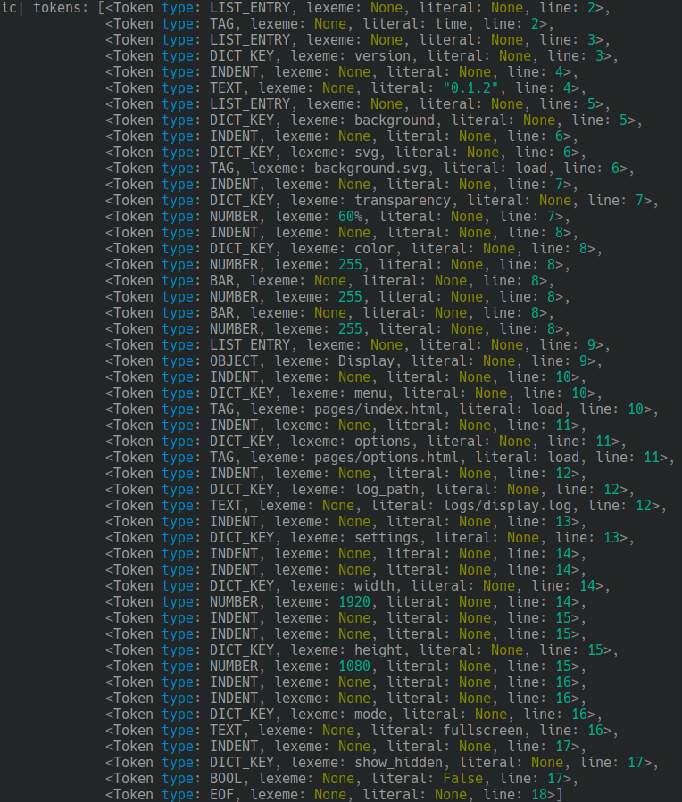

# Yam Parser
Yam configuration language parser for python


From language:

```
~~ Configuring display.
- <|time|>
- version:
    "0.1.2"
- background:
    svg: <load>background.svg</load>
    transparency: 60%
    color: 255|255|255
- !Display
    menu: <load>pages/index.html</load>
    options: <load>pages/options.html</load>
    log_path: logs/display.log
    settings:
      width: 1920
      height: 1080
      mode: fullscreen
    show_hidden: false

```

To Parsed tokens:


